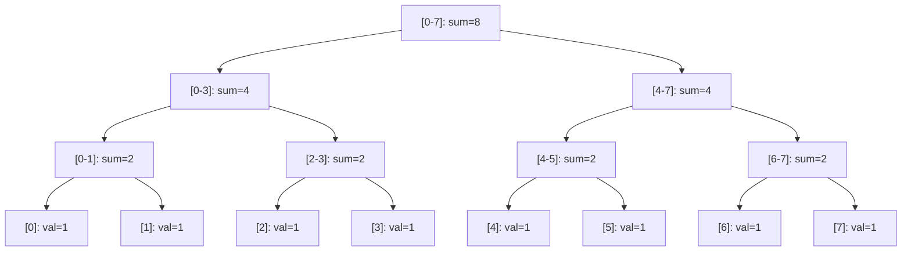
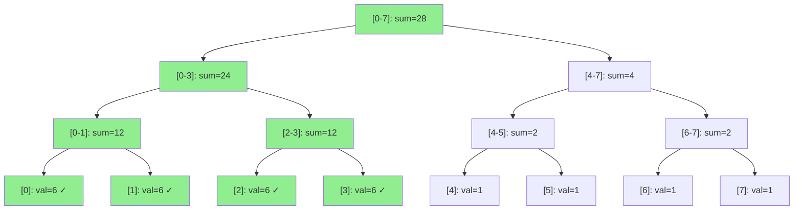
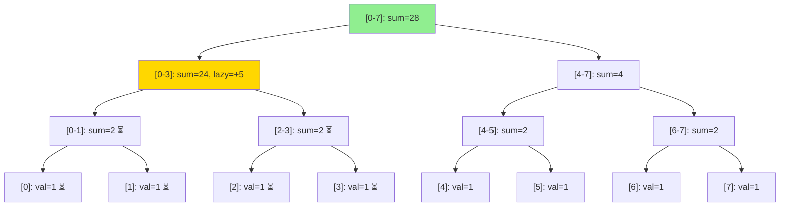

# Segment Trees with Lazy Propagation

## Background Motivation

During my time at Netflix, I witnessed firsthand how quickly data problems 
transform as systems scale. As the company transitioned from a DVD-based 
business to a global streaming platform, data volumes grew exponentially. 
What had once been manageable batch data about physical shipments became a 
continuous, high-velocity stream of every play, pause, rewind, and 
fast-forward across tens of millions of users and hundreds of millions of
devices globally.

The consequences of this exponential growth were significant and immediate. 
Processes that previously completed in hours now needed to be measured in 
half-day increments. Operations that were especially painful involved 
repeated computations over ranges of data: aggregating metrics across time 
windows, applying updates across subsets of records, or recalculating rolling 
statistics as new events arrived. The naive approach — iterating through every 
element in a range — runs in O(n) time and becomes impractical at scale.

## Project Objectives

This project implements and benchmarks three approaches to a common type of data
problem we encountered at Netflix -- efficiently computing and updating sums over
ranges of data.

The three approaches are:
- **Naive array** — the brute force baseline
- **Standard Segment Tree** — efficient range queries and point updates
- **Segment Tree with Lazy Propagation** — efficient range queries 
  AND range updates

The benchmark compares the performance of all three across dataset sizes ranging
from 1,000 to 100,000,000 elements, making the O(n) vs O(log n) performance gap 
visible and concrete.

## What are Segment Trees and Lazy Propagation

A Segment Tree is a binary tree built over an array where each node stores 
the precomputed sum of a specific range of elements. This allows range sum 
queries to run in O(log n) time by combining results from a small number of 
relevant nodes rather than scanning the full range.

A standard segment tree handles point updates efficiently, but range updates 
are costly because many affected leaves and ancestor nodes must be updated.
This is actually *slower* than the naive O(n) approach for range updates.

Lazy Propagation solves this by deferring updates instead of immediately 
propagating a change to all affected elements; any pending updates are stored at 
higher-level nodes and pushed down later only when the lower level nodes are 
accessed. The result is that both range queries and range updates run in O(log n) 
time.

### How a Standard Segment Tree Handles a Range Update

**Before:** Array of 8 elements, all initialized to 1. We then add 5 to indices 0–3.



**After:** Every affected leaf and parent node updated — O(n log n) work.



### How a Lazy Segment Tree Handles the Same Update

**Before:** Same initial tree.


**After:** Only the root and one internal node are updated. A Lazy value is recorded and deferred for children.



## How to Compile

From the `src` directory:

```bash
g++ -o benchmark benchmark.cpp naive.cpp segment_tree.cpp lazy_segment_tree.cpp
```

Requires a C++ compiler with C++11 support or later (g++ or clang++).

## How to Run

From the `src` directory:
```bash
./benchmark
```

The benchmark runs automatically across all dataset sizes and prints results 
to the console.

## Benchmark Methodology
To ensure fair and accurate comparisons, all three implementations were evaluated under identical conditions:
- A single randomly generated input array was used to initialize all data structures  
- Operation sequences (point updates, range updates, and queries) were pre-generated and replayed across all 
  implementations  
- Each benchmark measured only the target operation
- Checksums were computed after each benchmark to verify that all implementations produced identical final states  
- Benchmark computations were structured to ensure results contributed to observable outputs, preventing compiler 
  optimizations from eliminating work

These steps were critical to ensuring that observed performance differences reflect true algorithmic behavior rather than artifacts of the testing approach

## Results

Running the benchmark on a MacBook Pro with a M4 Pro processor produced the 
following results:

### Point Update (Naive vs Standard Segment Tree vs Lazy Segment Tree)

| Size | Naive | Segment Tree | Lazy Segment Tree | Winner |
|------|-------|-------------|-------------------|---------|
| 1K | 0.000583 ms | 0.01175 ms | 0.015334 ms | Naive |
| 10K | 0.000584 ms | 0.013917 ms | 0.017417 ms | Naive |
| 100K | 0.000709 ms | 0.023125 ms | 0.026167 ms | Naive |
| 1M | 0.0015 ms | 0.037 ms | 0.053792 ms | Naive |
| 10M | 0.00375 ms | 0.059542 ms | 0.101958 ms | Naive |
| 100M | 0.004792 ms | 0.070791 ms | 0.139834 ms | Naive |

### Range Sum (Naive vs Standard Segment Tree vs Lazy Segment Tree)

| Size | Naive | Segment Tree | Lazy Segment Tree | Winner |
|------|-------|-------------|-------------------|---------|
| 1K | 0.124 ms | 0.000542 ms | 0.000791 ms | Segment |
| 10K | 1.177 ms | 0.000375 ms | 0.000708 ms | Segment |
| 100K | 11.126 ms | 0.001 ms | 0.001042 ms | Segment |
| 1M | 117.903 ms | 0.000834 ms | 0.00125 ms | Segment |
| 10M | 1216.5 ms | 0.000959 ms | 0.001167 ms | Segment |
| 100M | 11667.7 ms | 0.000875 ms | 0.003375 ms | Segment |

### Range Update (Naive vs Standard Segment Tree vs Lazy Segment Tree)

| Size | Naive | Segment Tree | Lazy Segment Tree | Winner |
|------|-------|-------------|-------------------|---------|
| 1K | 0.04725 ms | 0.283542 ms | 0.035375 ms | Lazy |
| 10K | 0.351709 ms | 2.73225 ms | 0.049959 ms | Lazy |
| 100K | 3.88796 ms | 25.5655 ms | 0.118375 ms | Lazy |
| 1M | 46.229 ms | 298.339 ms | 0.1785 ms | Lazy |
| 10M | 387.457 ms | 2696.82 ms | 0.292875 ms | Lazy |
| 100M | 3954.32 ms | 27526.7 ms | 0.392041 ms | Lazy |

## Interpreting the Results

The results tell a clear story, though the story varies by tested function.

- **Point update** — Naive wins decisively at every size. A direct array 
  write (`arr[index] = value`) is a single operation, while both of the tree 
  implementations must traverse O(log n) nodes to ripple any changes upward. 
  That performance gap widens as the dataset size grows.

- **Range sum** — Both of the tree implementations are effectively instantaneous,
  regardless of dataset size, while Naive grows linearly. At 100M elements, 
  Naive takes over 11 seconds, while both trees take under a millisecond. 
  Standard Segment Tree narrowly edges out Lazy in most runs because Lazy carries 
  a small overhead from checking the lazy array even when no pending updates 
  exist.

- **Range update** — This is where we see the most significant result. Lazy 
Propagation dominates, while Standard Segment Tree turns out to be *worse 
than Naive*. This is because a range update on a standard Segment Tree must
touch every affected leaf and rebuild every parent node on the way back up,
which requires updating many affected leaves and recomputing their ancestor nodes, 
resulting in significantly higher overhead than the naive O(n) approach for large 
ranges. Lazy Propagation avoids this entirely by storing pending updates at 
high-level nodes and deferring much of the tree maintenance work the standard 
Segment tackles. At 100M elements, Naive takes ~4 seconds, Standard Segment 
Tree takes ~27 seconds, and Lazy takes under half a millisecond, which is 
a ~70,000x speedup over the Standard Segment Tree.

The key takeaway is that **there is no universally best data structure**. Ultimately,
the right choice depends entirely on your operational workload:

- **Range queries only** — either tree implementation works, and both are 
  dramatically faster than Naive
- **Point updates** — Naive is surprisingly competitive and simplest to implement
- **Range updates at scale** — Lazy Propagation is the clear winner, and 
  Standard Segment Tree should generally be avoided
- **Mixed workloads** — Lazy Propagation is the safest all-around choice, 
  though a mixed-workload benchmark would be needed to confirm its theoretical 
  advantage empirically

## Project Limitations and Future Work

- **Mixed workload testing** — this current benchmark measures each operation 
  in isolation. A more realistic benchmark would mix range updates and 
  range queries to better reveal Lazy Propagation's theoretical advantage in 
  real-world conditions.
- **Integer overflow** — an early version used `int` for range sum return 
  values and tree storage. At 100M elements with random values between 1 and 
  1000, the true sum exceeded `int`'s maximum of ~2.1 billion, silently 
  producing `-1,494,279,353` with no compiler warning. Fixed this issue by 
  switching to `long long` data type throughout.